### `HTML : Hypertext Markup Language`

***

- 웹을 이루는 가장 기초적인 구성 요소
- 웹 콘텐츠의 의미와 구조를 정의할 때 사용
- HTML 외의 다른 기술은 일반적으로 웹 페이지의 모양/표현(CSS), 기능/동작(JavaScript)


#### 📌 Hypertext

- 웹 페이지를 다른 페이지로 연결하는 링크
- 링크는 웹의 근본적인 속성


#### ✍️ HTML

- 웹 브라우저에 표시되는 글과 이미지 등의 다양한 콘텐츠를 표시하게 위해 `마크업` 사용

- 요소

  - 요소는 태그(<, >)를 사용해서 문서의 다른 텍스트와 구분한다

    - 태그 안의 요소 이름은 대소문자를 구분하지 않음
    - 여는 태그(opening tag)
      - 요소의 이름으로 구성되고, 여닫는 꺾쇠괄호로 감싸짐
      - 요소가 시작되는 곳, 또는 효과를 시작하는 곳임을 나타냄
    - 닫는 태그(closing tag)
      - 여는 태그와 같지만 요소의 이름 앞에 전방향 슬래시가 포함 됨
      - 요소의 끝을 나타냄
    - 컨텐츠(content)
      - 요소의 내용
    - 요소(element)
      - 여는 태그와 닫는 태그, 그리고 컨텐츠로 이루어짐

  - `head` : 문서 메타데이터 (헤더)

    - 기계가 식별할 수 있는 문서 정보(메타데이터)를 담음
    - 주 목적은 기계 처리를 위한 정보. 사람이 읽을 수 없음

  - `title` : 문서 제목 요소

    - 브라우저의 제목 표시줄이나 페이지 탭에 보이는 문서 제목 정의
    - 텍스트만 포함할 수 있으며 태그를 포함하더라도 무시함

    ```html
    <!doctype html>
    <html>
      <head>
        <title>문서 제목</title>
      </head>
    </html>
    ```

  - `body` : 문서 본문 요소

    - HTML 문서의 내용을 나타냄
    - 한 문서에 하나의 body 요소만 존재할 수 있음

    ```html
    <html>
      <head>
        <title>문서 제목</title>
      </head>
      <body>
        <p>문단입니다</p>
      </body>
    </html>
    ```

  - `header`

    - 소개 및 탐색에 도움을 주는 콘텐츠를 나타냄
    - 제목, 로고, 검색 폼, 작성자 이름 등의 요소도 포함할 수 있음

    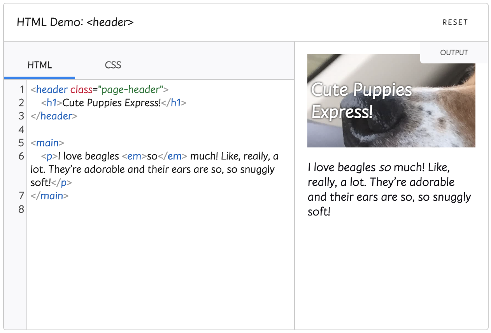

  - `footer`

    - 가장 가까운 구획 콘텐츠나 구획 루트의 푸터를 나타냄
    - 일반적으로 구획의 작성자, 저작권 정보, 관련 문서 등의 내용을 담음

    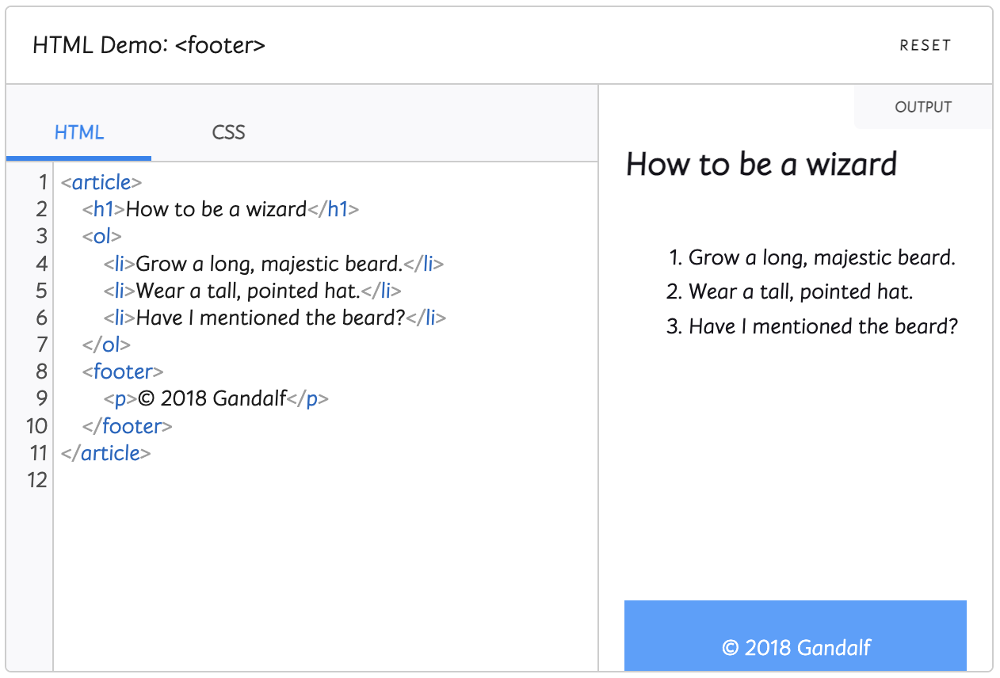

  - `article`

    - 문서, 페이지, 애플리케이션, 사이트 안에서 독립적으로 구분해 배포하거나 재사용할 수 있는 구획을 나타탬

    - 예시로 게시판, 블로그 글, 매거진, 뉴스 기사 등

    - 하나의 문서가 여러 개의 articla을 가질 수 있음

      - 사용자가 스크롤하면 계속해서 다음 글을 보여주는 블로그 글의 경우

        각각의 글이 article 요소가 되며 그 안에 또 여러 개의 section이 존재할 수 있음

    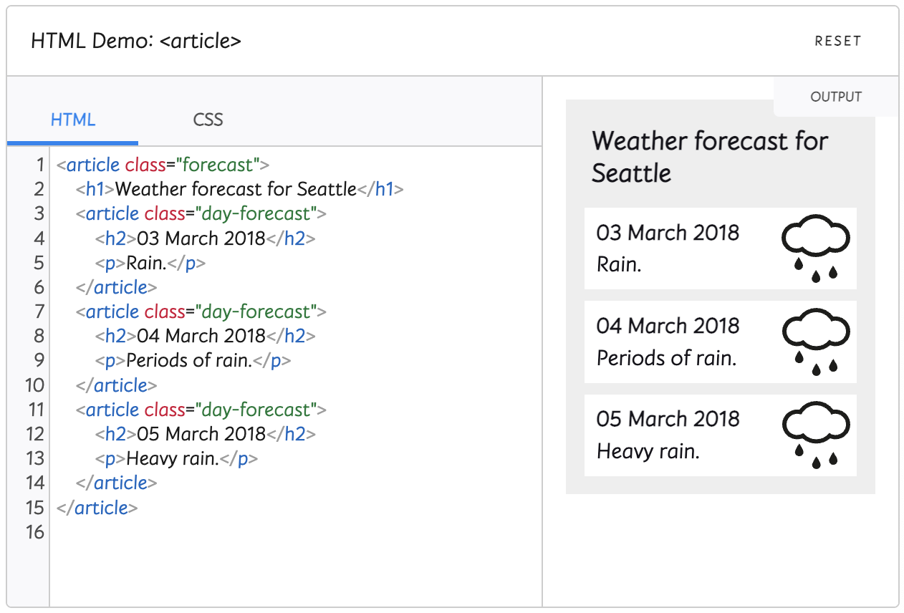

  - `section` : 일반 구획 요소

    - HTML 문서의 독립적인 구획을 나타냄
    - 더 적합한 의미를 가진 요소가 없을 때 사용
    - 보통 제목을 포함하지만 항상 그런 것은 아님

    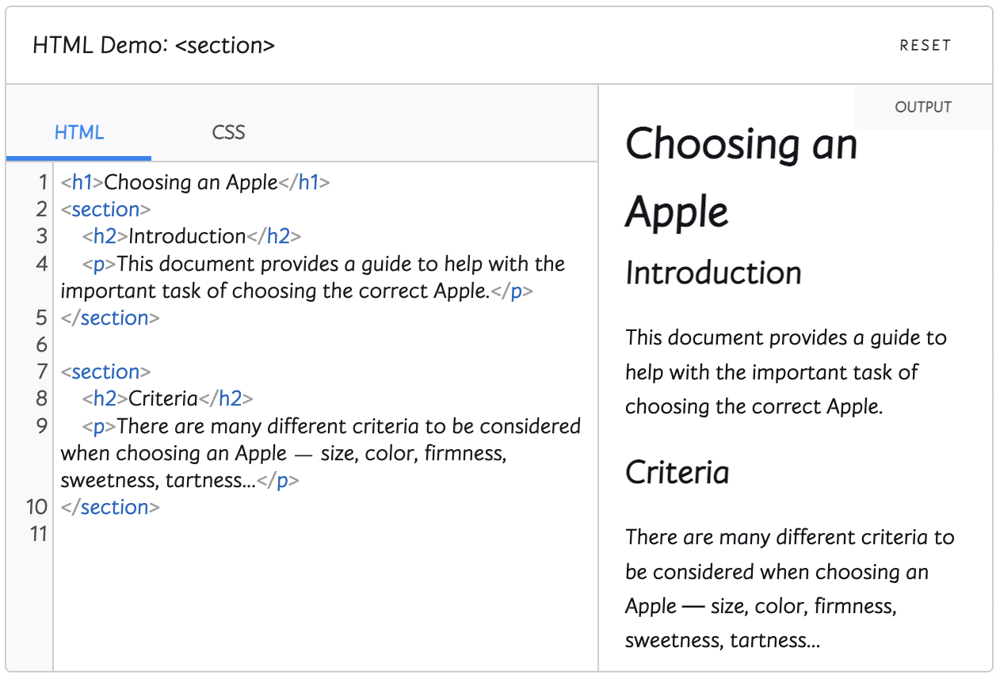

  - `p`

    - 하나의 문단을 나타냄

    ```html
    <p>첫 번째 문단입니다.
      첫 번째 문단입니다.
      첫 번째 문단입니다.
      첫 번째 문단입니다.</p>
    <p>두 번째 문단입니다.
      두 번째 문단입니다.
      두 번째 문단입니다.
      두 번째 문단입니다.</p>
    ```

    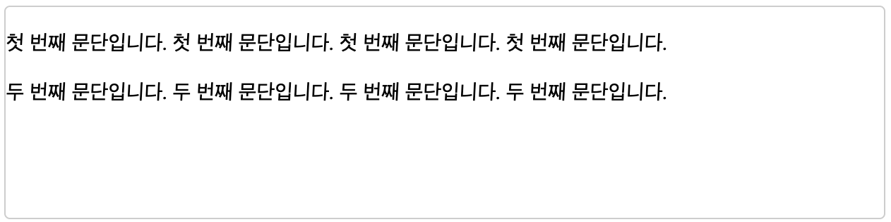

  - `div` : 콘텐츠 분할 요소

    - 플로우 콘텐츠를 위한 통용 컨테이너

    - CSS로 꾸미기 전에는 콘텐츠나 레이아웃에 어떠한 영향도 주지 않음

    - '순수' 컨테이너로서 아무것도 표현하지 않음

      - 대신 다른 요소 여럿을 묶어 class나 id 속성으로 꾸미기 쉽도록 돕거나

        문서의 특정 구역이 다른 언어임을 표시하는 등의 용도로 사용할 수 있음

    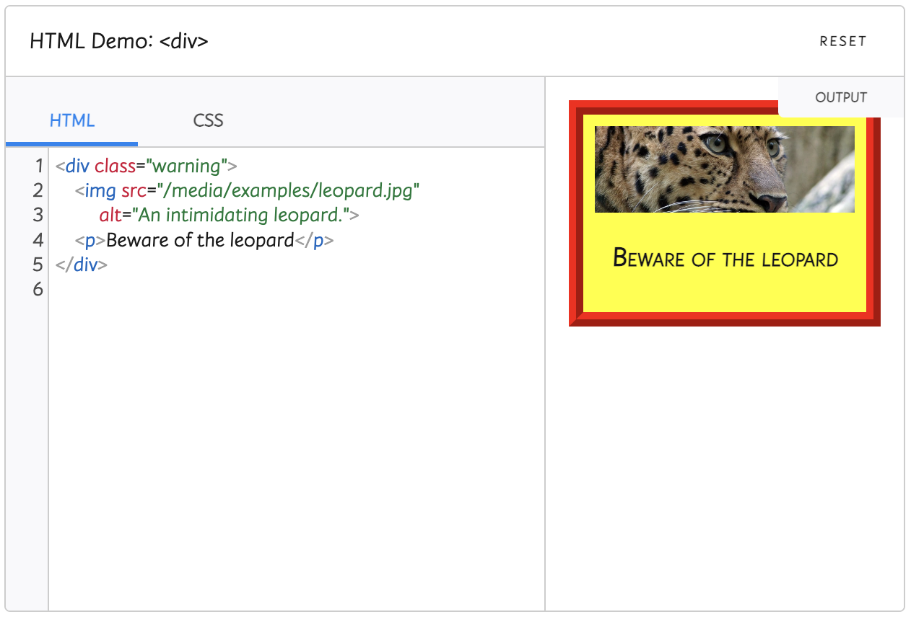

  - `span`

    - 구문 콘텐츠를 위한 통용 인라인 컨테이너
    - div와 매우 유사하지만 div는 블록 레벨 요소
    - 스타일을 적용하기 위해서 lang 등 어떤 특성의 값을 서로 공유하는 요소를 묶을 때 사용

    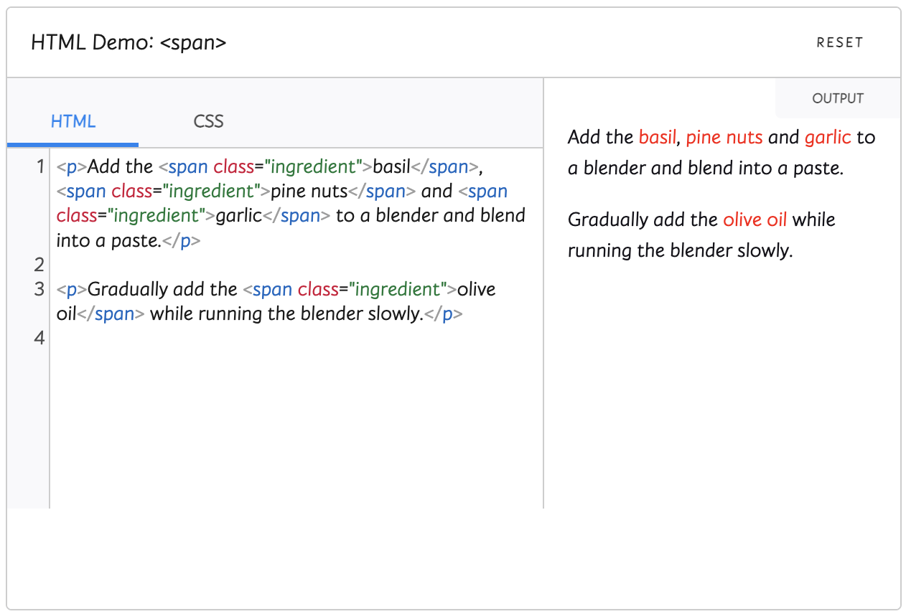

  - `img` : 이미지 삽입 요소

    - 문서에 이미지 삽입

      - src 특성은 필수. 포함하고자 하는 이미지의 경로 지정

      - alt 특성은 이미지의 텍스트 설명. 스크린 리더가 alt의 값을 읽어 사용자에게 이미지 설명하므로 접근성 차원에서 매우 유용.

        또한 네트워크 오류, 콘텐츠 차단, 죽은 링크 등 이미지를 표시할 수 없는 경우에도 이 속성의 값을 대신 보여줌

    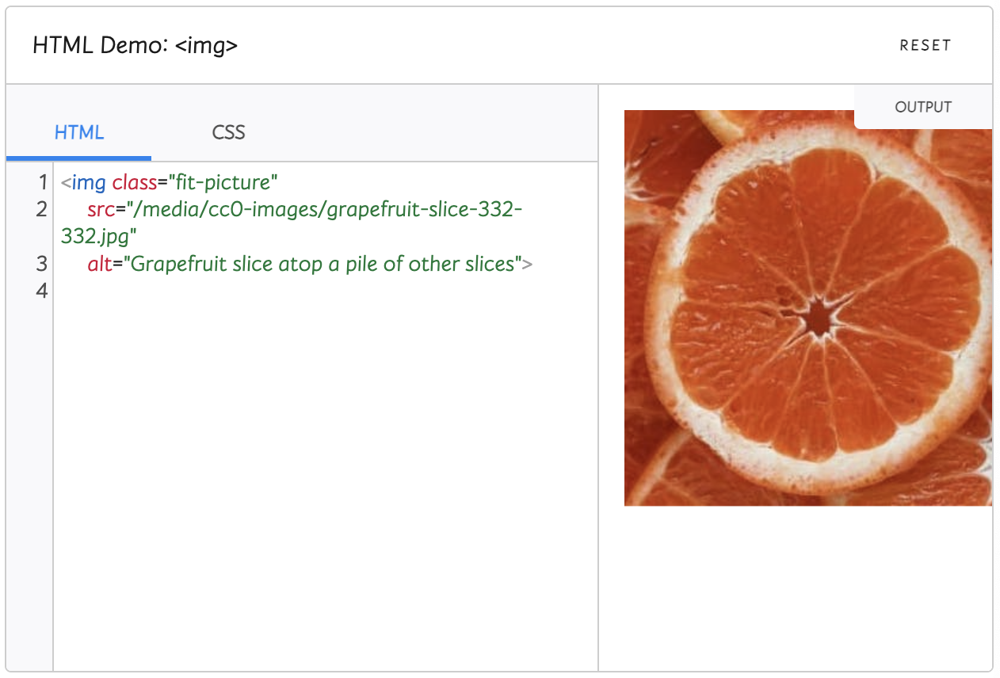

    - [참고 - MDN img 상세 설명](https://developer.mozilla.org/ko/docs/Web/HTML/Element/img)

  - `aside` : 별도 구획 요소

    - 문서의 주요 내용과 간접적으로만 연관된 부분을 나타냄
    - 주로 사이드바 혹은 콜아웃 박스로 표현

    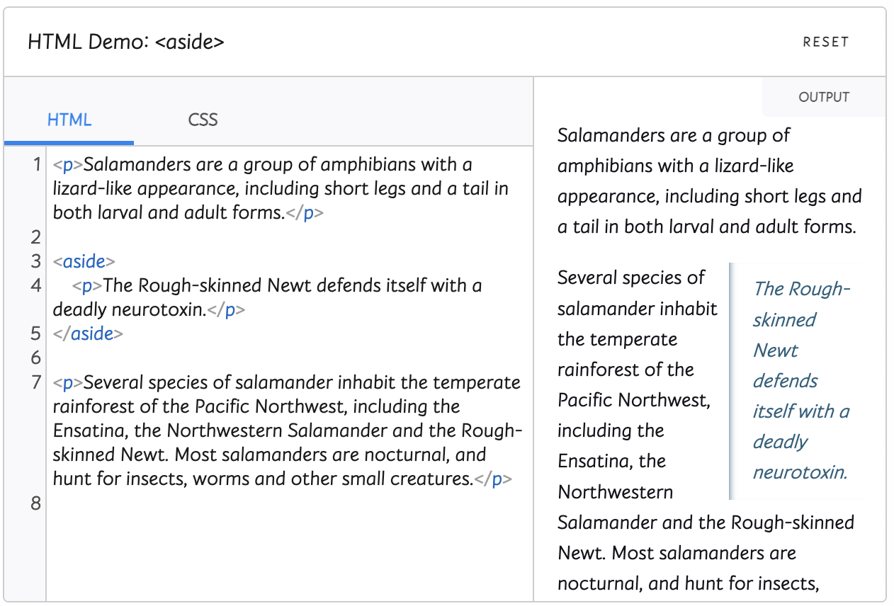

  - `audio`

    - 문서에 소리 콘텐츠를 포함할 때 사용
    - src 특성 또는 source 요소를 사용해 한 개 이상의 오디오 소스를 지정할 수 있음
      - 다수를 지정한 경우 가장 적절한 소스를 브라우저가 고름

    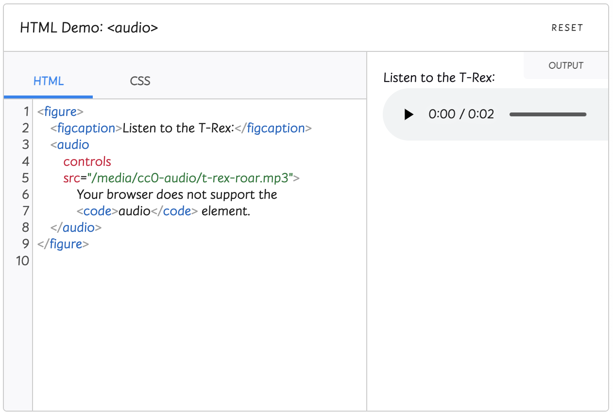

    - [참고 - MDN audio 상세 설명](https://developer.mozilla.org/ko/docs/Web/HTML/Element/audio)

  - `canvas` : 그래픽 캔버스 요소

    - [캔버스 스크립팅 API](https://developer.mozilla.org/ko/docs/Web/API/Canvas_API) 또는 [WebGL API](https://developer.mozilla.org/ko/docs/Web/API/WebGL_API)와 함께 사용해 그래픽과 애니메이션을 그릴 수 있음
    - [참고 - MDN canvas 상세 설명](https://developer.mozilla.org/ko/docs/Web/HTML/Element/canvas)

  - `datalist`

    - 다른 컨트롤에서 고를 수 있는 가능한, 혹은 추천하는 선택지를 나타내는 option 요소 여럿을 담음

    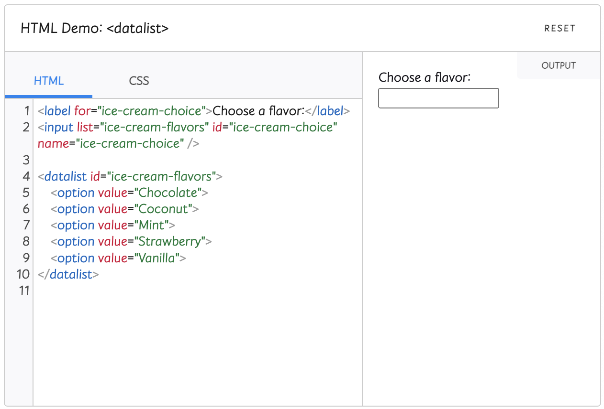

  - `details`

    - '열림' 상태일 때만 내부 정보를 보여주는 정보 공개 위젯을 생성
    - 요약이나 레이블은 summary 요소를 통해 제공할 수 있음
    - 보통 레이블 옆의 작은 삼각형이 돌아가면서 열림/닫힘 상태를 나타냄

    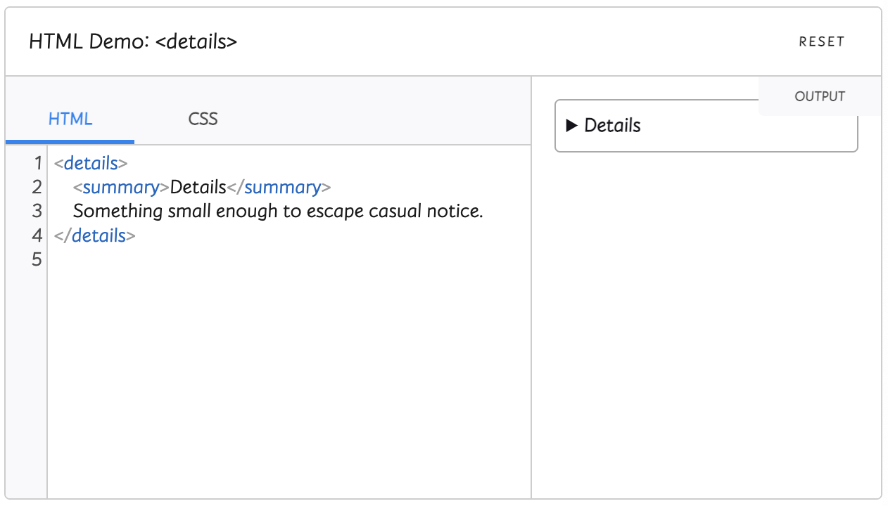

  - `embed`

    - 외부 어플리케이션이나 대화형 컨텐츠와의 통합점을 나타냄

    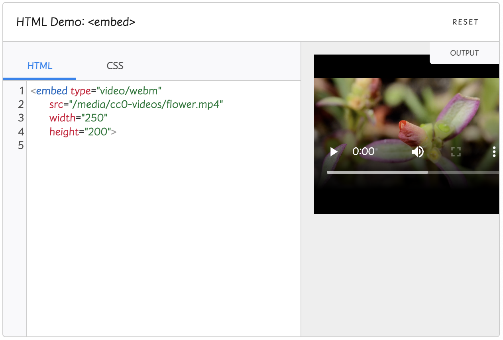

  - `nav` : 탐색 구획 요소

    - 문서의 부분 중 현재 페이지 내 또는 다른 페이지로의 링크를 보여주는 구획을 나타냄
    - 자주 쓰이는 예제는 메뉴, 목차, 색인

    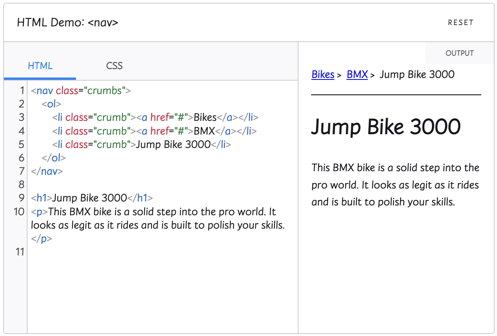

  - `output` : 출력 요소

    - 웹 사이트나 앱에서 계산이나 사용자 행동의 결과를 삽입할 수 있는 컨테이너 요소
    - [참고 - MDN output 상세 설명](https://developer.mozilla.org/ko/docs/Web/HTML/Element/output)

  - `progress`

    - 어느 작업의 완료 정도를 나타냄
    - 주로 진행 표시줄의 형태를 띄움

    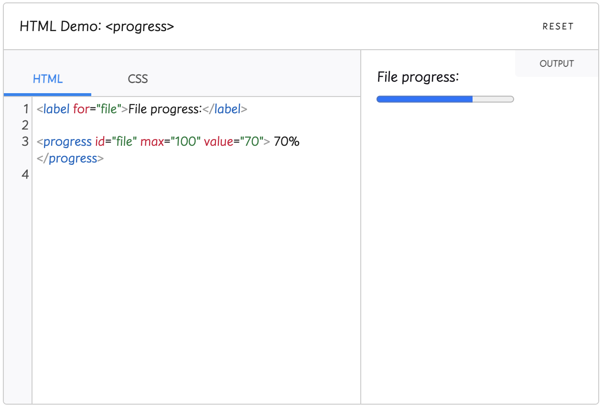

  - `video` : 비디오 삽입 요소

    - 비디오 플레이백을 지원하는 미디어 플레이어를 문서에 삽입
    - 오디오 콘텐츠에도 사용할 수 있으나 audio 요소가 사용자 경험에 좀 더 적합
    - img 요소와 비슷하게 표시하고자 하는 미디어의 경로를 src 특성에 제공
    - 비디오의 너비와 높이, 자동재생과 반복 여부, 브라우저 기본 컨트롤 노출 여부 등 다른 정보도 특성을 통해 지정할 수 있음

    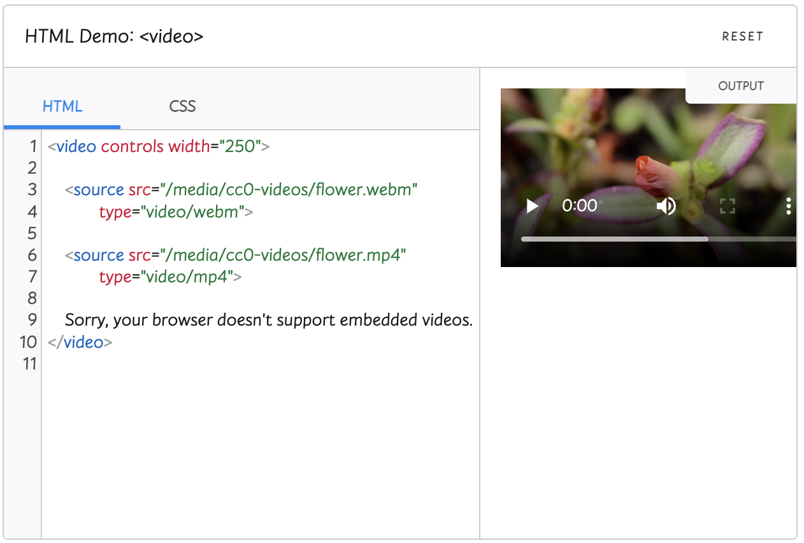

    - [참고 - MDN video 상세 설명](https://developer.mozilla.org/ko/docs/Web/HTML/Element/Video)

  - `ul`

    - 정렬되지 않은 목록
    - 보통 불릿으로 표현

    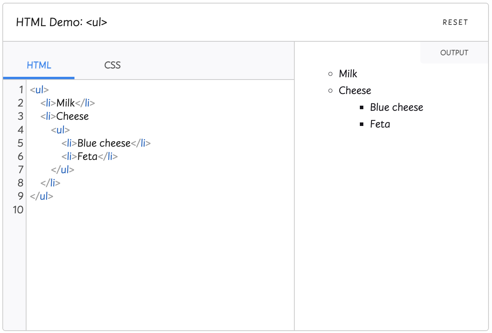

  - `ol`

    - 정렬된 목록
    - 보통 숫자 목록으로 표현

    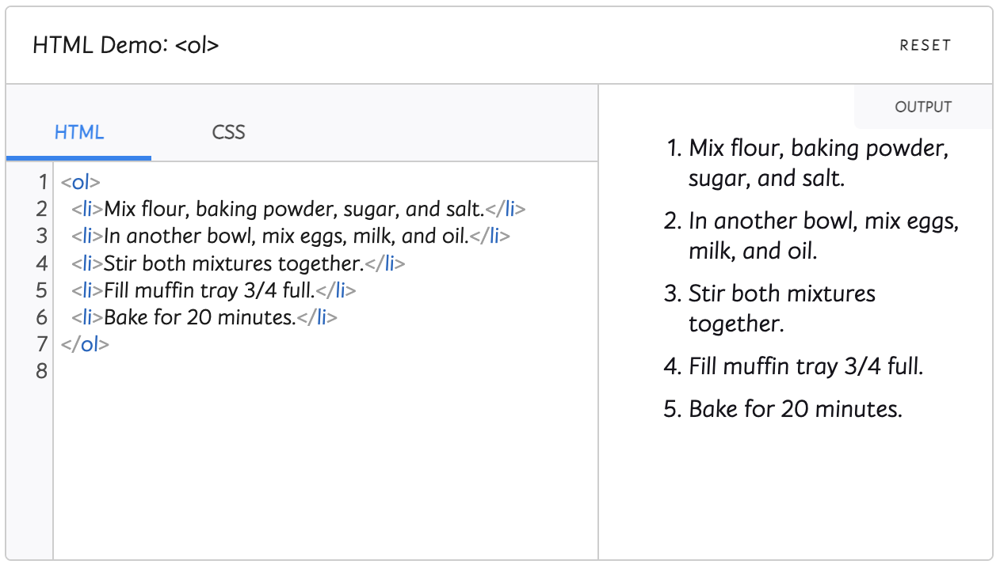

  - `li`

    - 목록의 항목을 나타냄

    - 반드시 정렬 목록(ol), 비정렬 목록(ul), 메뉴(menu) 안에 위치해야 함

      - 메뉴와 비정렬 목록에서는 보통 불릿으로 항목을 나타내고

        정렬 목록에서는 숫자나 문자를 사용한 오름차순 카운터로 나타냄

    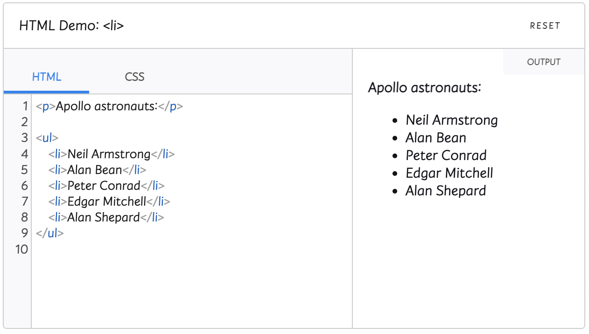


***


#### 🔎 참고 문서

- [MDN HTML](https://developer.mozilla.org/ko/docs/Web/HTML)