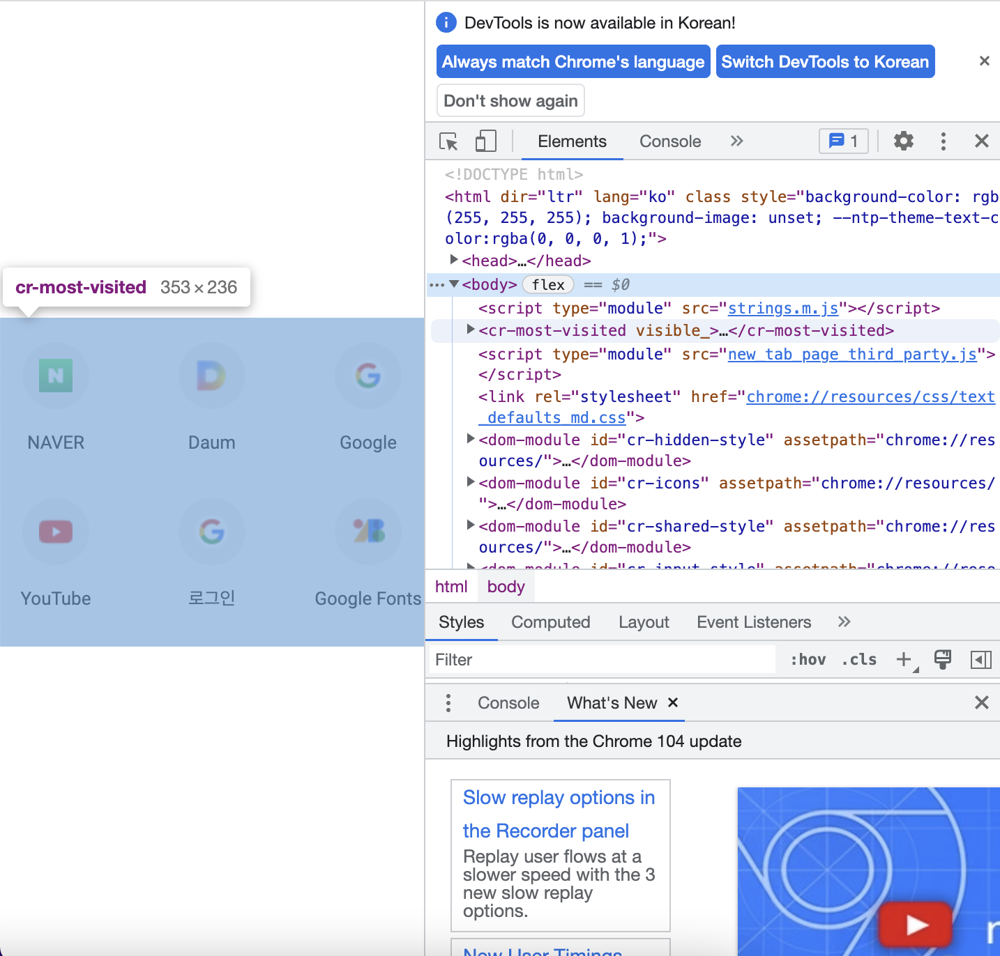

### `CSS 배우기 - 박스(box) 모델`

***

- CSS가 표시하는 모든 것은 박스

- CSS Box Model이 작동하는 방식을 이해하는 것은 CSS의 핵심 기반

- 콘텐츠 및 크기

  - 박스는 `display`값, 설정된 치수 및 박스 안에 있는 내용에 따라 다르게 동작

  - 콘텐츠는 자식 요소에 의해 생성된 더 많은 수의 박스 또는 일반 텍스트 콘텐츠일 수 있고,

    기본적으로 박스의 크기에 영향을 미침

  - `외부 크기 조정`을 사용해 이를 제어, `내부 크기 조정`을 사용하여 콘텐츠 크기를 기반으로 브라우저가 계속 결정하도록 할 수 있음

  - `overflow`

    - 콘텐츠가 박스에 비해 너무 크면 발생
    - 오버플로 되는 현상을 방지하는 한 가지 방법은 `width`를 `min-content`로 설정하여 박스의 크기를 내부 크기로 설정 *(min-content 키워드는 박스가 콘텐츠의 최소 내부 너비만큼만 넓어지도록 지시)*

- 박스 모델의 영역

  - 박스는 모두 특정 작업을 수행하는 별개의 박스 모델 영역으로 구성

  
  
  - `Content box(콘텐츠 박스)`
    - 콘텐츠가 있는 영역
    - 콘텐츠는 부모 콘텐츠의 크기를 제어할 수 있으며, 일반적으로 가장 다양한 크기의 영역도 제어
  - `Padding box(패딩 박스)`
    - 콘텐츠 박스를 둘러싸고 있으며 `padding` 속성에 의해 생성된 공간
    - 패딩이 박스 안에 있기 때문에 박스의 배경을 박스가 만드는 공간에서 볼 수 있음
    - `overflow: auto`, `overflow: scroll`과 같은 오버플로 규칙이 설정되어 있으면 스크롤바도 공간을 차지하게 됨
  - `Border box(테두리 박스)`
    - 패딩 박스를 둘러싸고 있으며 `border` 값으로 채워짐
    - 박스의 경계이며 테두리 가장자리는 시각적으로 볼 수 있는 영역의 한계
  - `Margin box(여백 박스)`
    - `margin` 규칙에 의해 정의된 박스 주변의 공간
    - `outline` 및 `box-shadow`와 같은 속성이 페인트처럼 상단을 칠하며 공간을 차지하기 때문에 박스의 크기에 영향을 미치지 않음
    - `outline-width`가 200px일 수 있으며 테두리 박스를 포함하여 내부의 모든 것이 정확히 같은 크기일 수 있음
  
- 박스 모델 디버깅

  - 개발자 도구 열기

  
  
  
  
  - 요소 선택
  
  
  
  - 박스 모델 디버거 표시
  
  

- 박스 모델 제어

  - 아래 예시의 `.my-box`의 너비는 얼마나 될까?

  ```css
  .my-box {
    width: 200px;
    border: 10px solid;
    padding: 20px;
  }
  ```

  > 이 박스의 실제 너비는 260px
  >
  > CSS는 기본 `box-sizing: content-box`를 사용하기 때문에 적용되는 너비는 콘텐츠의 너비이며 `padding`과 `border`가 양쪽에 추가 됨
  >
  > 따라서 콘텐츠 200px + 패딩 40px + 테두리 20px로 총 260px의 가시 너비를 만듦

  - 대체 박스 모델인 `border-box`를 사용하도록 다음과 같이 수정하면 이를 제어하는 것이 가능

  ```css
  .my-box {
    box-sizing: border-box;
    width: 200px;
    border: 10px solid;
    padding: 20px;
  }
  ```

  