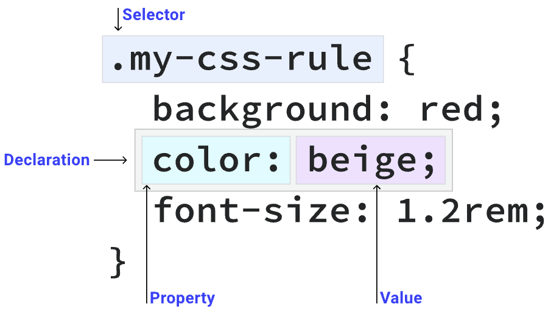

### `CSS 배우기 - Selectors`

***

- CSS 규칙의 일부

  - CSS 규칙은 하나 이상의 선택자와 하나 이상의 선언을 포함하는 코드 블록

  

  - 단순 선택자

    - 가장 간단한 선택자 그룹은 HTML 요소와 HTML 태그에 추가할 수 있는 클래스, ID 및 기타 속성을 대상으로 함

    - 범용 선택자

      - 아래의 규칙은 페이지의 모든 HTML 요소가 핫핑크 텍스트를 갖도록 함

        ```css
        * {
          color: hotpink;
        }
        ```

    - 유형 선택자

      - 아래의 규칙은 `<section>` 요소가 모든 면에 `padding`의 `2em`을 갖게 함

      ```css
      section {
        padding: 2em;
      }
      ```

    - 클래스 선택자

      - HTML은 `class` 속성에 정의된 하나 이상의 항목을 가질 수 있음
      - 클래스 선택자는 해당 클래스가 적용된 모든 요소와 일치
      - 아래의 클래스가 적용된 모든 요소는 빨간색으로 표시 됨

      ```css
      <div class="my-class"></div>
      <button class="my-class"></button>
      <p class="my-class"></p>
      ```

      ```css
      .my-class {
        color: red;
      }
      ```

      - `.` 문자는 클래스 속성 멤버와 일치하도록 CSS 언어를 지시

        선택자 유형을 정의하는데 사용되는 CSS의 일반적인 패턴

      - `.my-class`의 클래스가 있는 HTML 요소는 다음과 같이 다른 클래스가 여러 개 있더라도 위의 CSS 규칙과 일치

      ```css
      <div class="my-class another-class some-other-class"></div>
      ```

    - ID 선택자

      - `id` 속성이 있는 HTML 요소는 해당 ID 값을 가진 페이지의 유일한 요소여햐 함

      ```css
      #rad {
        border: 1px solid blue;
      }
      ```

      - 아래의 CSS는 다음과 같이 `id`가 `rad`인 HTML 요소에 파란색 테두리를 적용

      ```css
      <div id="rad"></div>
      ```

      - `#` 문자를 사용하여 CSS가 뒤에 `id`와 일치하는 요소를 찾도록 지시

    - 속성 선택자

      - 특정 HTML 속성이 있거나 HTML 속성에 대한 특정 값이 있는 요소를 찾을 수 있음
      - 대괄호(`[]`)로 묶어 CSS가 속성을 찾도록 지시

      ```css
      [data-type='primary'] {
        color: red;
      }
      ```

      - 아래의 CSS는 다음과 같이 `primary` 값을 가진 `data-type` 속성이 있는 모든 요소를 찾음

      ```css
      <div data-type='primary'></div>
      ```

      - `data-type`의 특정 값을 찾는 대신 값에 관계없이 속성이 있는 요소를 찾을 수도 있음

      ```css
      [data-type] {
        color: red;
      }
      ```

      ```css
      <div data-type="primary"></div>
      <div data-type="secondary"></div>
      ```

      - 아래의 `div` 요소는 모두 빨간색 텍스트를 가짐

        `s` 연산자를 추가하여 대소문자를 구분하는 속성 선택자를 사용할 수 있음

      ```css
      [data-type='primary' s] {
        color; red;
      }
      ```

      > HTML 요소에 `primary` 대신 `primary`의 `data-type`이 있던 경우 빨간색 텍스트를 얻지 않음
      >
      > `i` 연산자를 사용하여 대소문자를 구분하지 않게 수행할 수 있음

      - 대소문자 연산자와 함께 속성 값 내의 문자열 부분과 일치하는 연산자에 액세스 할 수 있음

      ```css
      /* "example.com"을 포함하는 href */
      [href*='example.com'] {
        color: red;
      }
      
      /* https로 시작하는 href */
      [href^='https'] {
        color: green;
      }
      
      /* .com 로 끝나는 href */
      [href$='.com'] {
        color: blue;
      }
      ```

    - 그룹화 선택자

      - 여러 선택자를 쉼표로 구분하여 그룹화할 수 있음

      - 아래의 예시는 색상 변경을 `<strong>` 요소와 `<em>` 요소 모두로 확장

        `.my-class`라는 클래스와 `lang` 속성이 있는 요소로 확장

      ```css
      strong,
      em,
      .my-class,
      [lang] {
        color: red;
      }
      ```

  - 복잡한 선택자

    - 결합자
      - 두 선택자 사이에 있는 것
      
      - 예) 선택자가 `p > strong`이면 결합자는 `>` 문자
      
      - 결합자를 사용하는 선택자는 문서에서의 위치에 따라 항목을 선택하는데 도움이 됨
      
      - 하위 결합자
        -  아래의 스니펫은 `<p>` 요소의 하위 요소인 `<strong>` 요소만 선택하여 반복해서 파란색으로 만듦
        
        ```css
        <p>A paragraph of text with some <strong>bold text for emphasis</strong>.</p>
        ```
        
        ```css
        p strong {
          color: blue;
        }
        ```
        
      - 복합 선택자
        
        - 선택자를 결합하여 특이성과 가독성을 높일 수 있음
        - 예) `.my-class` 클래스도 포함하는 `<a>` 요소를 대상으로 하려면 다음과 같이 작성
        
        ```css
        a.my-class {
          color: red;
        }
        ```
        
        > 모든 링크에 빨간색이 적용되는 것은 아니며 `<a>` 요소일 경우 `.my-class`에만 빨간색이 적용 됨