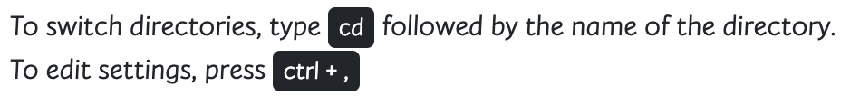
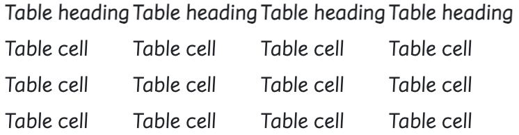

### `Reboot`

***

##### 🔎 접근

- Normalize를 기반으로 하며 요소 선택자만을 사용하여 많은 HTML 요소에 독단적인 스타일 제공
  - 예) 간단한 기준선을 위해 `<table>` 스타일을 재부팅하고 나중에 `.table`, `.table-bordered` 등을 제공
- `reboot`에서 덮어쓸 항목을 선택하는 가이드라인과 이유
  - 확장 가능한 구성요소 간격을 위해 `em` 대신 `rem`을 사용하도록 일부 브라우저 기본값을 업데이트 함
  - 여백 상한은 피해라. 수직 여백이 무너져 예상치 못한 결과를 초래할 수 있음
  - 장치 크기에 따라 쉽게 확장할 수 있도록 블록 요소는 여백에 `rem`을 사용해야 함
  - 가능하면 상속을 사용하여 글꼴 관련 속성의 선언을 최소한으로 유지


##### 🔎 페이지 기본값

- `html` 및 `body` 요소는 더 나은 페이지 범위의 기본값을 제공하기 위해 업데이트

  - 상자 크기는 `before` 및 `after`를 포함하여 모든 요소에 대해 전역적으로 설정 됨

    이렇게 하면 패딩 또는 테두리로 인해 요소의 선언된 너비를 초과하지 않음

    - 기본 글꼴 크기는 `html`에 선언되지 않지만 16px가 가정됨(브라우저 기본값)

    - 글꼴 크기 : `1rem`을 `body`에 적용하여 미디어 쿼리를 통해 쉽게 응답할 수 있게 하는 동시에 사용자 선호도를 존중하고 보다 접근하기 쉬운 접근 방식을 보장

      `$font-size-root` 변수를 수정하여 브라우저 기본값을 재정의할 수 있음

  - `body`는 또한 global `font-family`, `font-weight`, `line-height`, `color`를 설정

    글꼴 불일치를 방지하기 위해 나중에 일부 양식 요소에 상속됨

  - 안전을 위해 `body`에는 선언된 배경색이 있으며 기본값은 `#fff`이다


##### 🔎 Native font stack

- 부트스트랩은 `Native font stack` 또는 `system font stack`을 사용하여 모든 장치와 OS에서 최적의 텍스트 렌더링을 제공함

- 이러한 시스템 글꼴은 화면 렌더링 개선, 가변 글꼴 지원 등을 통해 오늘날의 장치를 염두에 두고 특별히 설계 됨

  ```css
  $font-family-sans-serif:
    // Cross-platform generic font family (default user interface font)
    system-ui,
    // Safari for macOS and iOS (San Francisco)
    -apple-system,
    // Windows
    "Segoe UI",
    // Android
    Roboto,
    // older macOS and iOS
    "Helvetica Neue"
    // Linux
    "Noto Sans",
    "Liberation Sans",
    // Basic web fallback
    Arial,
    // Sans serif fallback
    sans-serif,
    // Emoji fonts
    "Apple Color Emoji", "Segoe UI Emoji", "Segoe UI Symbol", "Noto Color Emoji" !default;
  ```

- 글꼴 스택에는 이모티콘 글꼴이 포함되므로 많은 공통 기호/딩배트 유니코드 문자가 여러 색상의 그림 문자로 렌더링 됨

- 브라우저/플랫폼의 기본 이모티콘 글꼴에 사용되는 스타일에 따라 모양이 달라지며 CSS 색상 스타일에 영향을 받지 않음

- 이 글꼴 계열은 `body`에 적용되며 부트스트랩 전체에서 자동으로 전역으로 상속됨

  - `global font-family`를 전환하려면 `$font-family-base`를 업데이트하고 부트스트랩을 다시 컴파일


##### ✍️ 제목과 단락

- 모든 표제 요소(예: `<h1>` 및 `<p>`)는 여백 상단이 제거되도록 재설정
- 머리글은 `margin-bottom` : 5rem, 단락 `margin-bottom` : 1rem이 추가되어 띄어쓰기를 쉽게 할 수 있음

| Heading       | Example                    |
| ------------- | -------------------------- |
| < h1 >< /h1 > | <h1>Bootstrap heading</h1> |
| < h2 >< /h2 > | <h2>Bootstrap heading</h2> |
| < h3 >< /h3 > | <h3>Bootstrap heading</h3> |
| < h4 >< /h4 > | <h4>Bootstrap heading</h4> |
| < h5 >< /h5 > | <h5>Bootstrap heading</h5> |
| < h6 >< /h6 > | <h6>Bootstrap heading</h6> |


##### ✍️ 수평 규칙

- `<hr>` 요소가 단순화 됨. 브라우저 기본값과 유사하게 `<hr>`은 경계 상단을 통해 스타일링되며 기본 `opacity: .25`를 가지며 부모를 통해 색상이 설정되는 경우를 포함하여 자동으로 경계 색상을 상속
  - `text`, `border`, `opacity` 유틸리티를 사용하여 수정할 수 있음

```html
<hr>

<div class="text-success">
  <hr>
</div>

<hr class="border border-danger border-2 opacity-50">
<hr class="border border-primary border-3 opacity-75">
```


##### ✍️ 리스트

- 모든 목록(`<ul>`, `<ol>`, `<dl>`)은 `margin-top`이 제거되고 `margin-bottom`이 1rem

- 중첩된 목록에는 `margin-bottom`이 없음

- `<ul>` 및 `<ol>` 요소의 `padding-left`를 재설정

- 간단한 스타일링, 명확한 계층 구조 및 더 나은 간격을 위해 설명 목록에는 `margin`이 업데이트 됨

- `<dd>`는 `margin-left`를 0으로 재설정하고 `margin-bottom: 0.5rem` 추가

  `<dt>`는 굵게 표시됨


##### ✍️ 인라인 코드

- 코드의 인라인 스니펫을 `<code>`로 포장. HTML 각괄호를 탈출해야 함

```html
<!-- 예 -->
<!-- 인라인으로 래핑 -->
<code>section</code>
```


##### ✍️ 코드 블럭

- 여러 줄의 코드에 대해 `<pre>`를 사용함
- `<pre>` 요소가 재설정되어 `margin-top`을 제거하고 `margin-bottom`으로 `rem` 단위를 사용함

```html
<p>Sample text here...</p>
<p>And another line of sample text here...</p>

------------------------------------------------

<pre><code>text sample
and another line of sample text
</code></pre>
```


##### ✍️ 변수

- 변수를 나타내려면 `<var>` 태그를 사용

```html
<!-- y = mx + b -->
<var>y</var> = <var>m</var><var>x</var> + <var>b</var>
```


##### ✍️ 사용자 입력

- `<kbd>`를 사용해 일반적으로 키보드를 통해 입력되는 입력을 나타냄



```html
To switch directories, type <kbd>cd</kbd> followed by the name of the directory.<br>
To edit settings, press <kbd><kbd>ctrl</kbd> + <kbd>,</kbd></kbd>
```


##### ✍️ 샘플 출력

- 프로그램의 `sample output`을 표시하려면 `<samp>` 태그를 사용

```html
<samp>This text is meant to be treated as sample output from a computer program.</samp>
```


##### ✍️ 표

- 표는 스타일 `caption`에 맞게 약간 조정되고 테두리를 접으며 전체적으로 일관된 `text-align`을 보장함
- 테두리, 패딩 등에 대한 추가 변경사항은 `.table` 클래스와 함께 제공 됨



```html
<table>
  <caption>
    This is an example table, and this is its caption to describe the contents.
  </caption>
  <thead>
    <tr>
      <th>Table heading</th>
      <th>Table heading</th>
      <th>Table heading</th>
      <th>Table heading</th>
    </tr>
  </thead>
  <tbody>
    <tr>
      <td>Table cell</td>
      <td>Table cell</td>
      <td>Table cell</td>
      <td>Table cell</td>
    </tr>
    <tr>
      <td>Table cell</td>
      <td>Table cell</td>
      <td>Table cell</td>
      <td>Table cell</td>
    </tr>
    <tr>
      <td>Table cell</td>
      <td>Table cell</td>
      <td>Table cell</td>
      <td>Table cell</td>
    </tr>
  </tbody>
</table>
```


##### ✍️ Forms

- 간단한 기본 스타일을 위해 다양한 양식 요소가 리부트 됨
- 자주 사용하는 변경 사항
  - `<fieldset>`은 `border`, `padding`, `margin`이 없으므로 개별 입력 또는 입력 그룹의 래퍼로 쉽게 사용할 수 있음
  - `<fieldset>`과 마찬가지로 `<syslog>`도 정렬 제목으로 표시되도록 다시 정렬 됨
  - `<label>`은 여백을 적용할 수 있도록 인라인 블록을 표시하게 설정
  - `<input>`, `<select>`, `<text area>`, `<button>`은 대부분 Normalize로 처리되지만 reboot은 `margin`을 제거하고 `line-height`도 설정함
  - `<text area>`는 수평 크기 조정은 종종 페이지 레이아웃에 따라 수직 크기 조정만 가능하도록 수정
  - `<button>` 및 `<input>` 버튼 요소에는 `:not(:disabled)`일 때 `cursor: pointer`가 있음